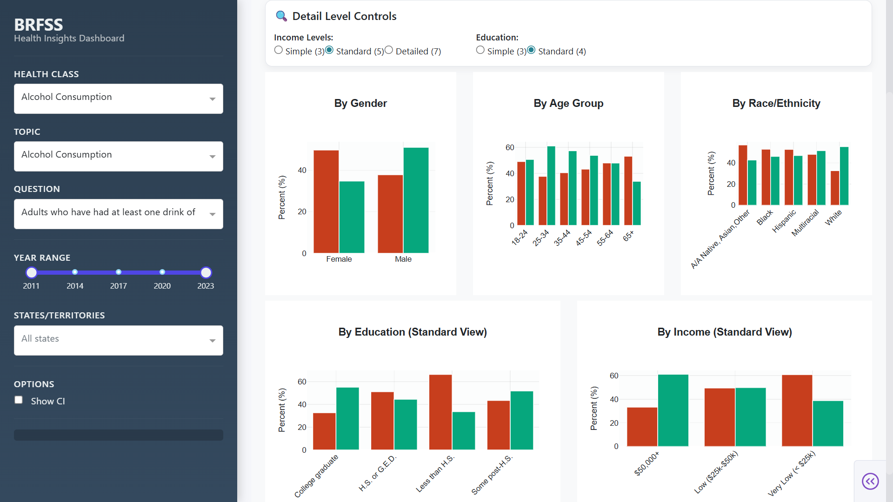

# BRFSS Health Insights Dashboard

> Interactive health analytics dashboard for exploring CDC BRFSS prevalence data across demographics, geography, and time

[](https://www.python.org/)
[](https://dash.plotly.com/)

Explore health trends from **2011–2023**, compare geographic regions, and analyze demographic disparities with statistical confidence intervals. Optimized for large datasets using **Parquet caching (PyArrow)**.

---

## ✨ Key Features

- **Hierarchical exploration** — Navigate through Health Class → Topic → Question
- **13-year temporal analysis** — Track trends from 2011 to 2023
- **Comprehensive demographic breakouts** — Gender, age group, race/ethnicity, education, income
- **Geographic intelligence** — State-level data with census region/division groupings and interactive choropleth maps
- **Statistical rigor** — 95% confidence intervals, sample sizes, and trend deltas
- **Performance optimized** — Handles 1GB+ datasets with Parquet caching for sub-second reloads

---

## 📸 Screenshots

### Overview


### Demographics


### Geography


### Compare


### Insights


---

## 🛠️ Tech Stack

**Core:** Python 3.10 | Plotly Dash | Dash Bootstrap Components  
**Data Processing:** Pandas | NumPy  
**Performance:** PyArrow/Parquet (caching & optimization)

---

## 🚀 Quick Start

### Prerequisites
- Python 3.10+
- Conda (recommended) or pip

### Installation

1. **Clone the repository**
```bash
git clone <your-repo-url>
cd brfss-dashboard
```

2. **Create environment and install dependencies**
```bash
conda create -n brfssdash python=3.10 -y
conda activate brfssdash
pip install -r requirements.txt
```

3. **Add the dataset**

The BRFSS dataset (>1GB) is not included in this repository. 

Create the data directory and add the CSV file:
```
data/
└── Prevalence_Data.csv
```

📥 **Dataset source:** [CDC BRFSS Prevalence Data Portal](https://www.cdc.gov/brfss/)

4. **Launch the dashboard**
```bash
python app.py
```

Open your browser to: `http://127.0.0.1:8050/`

---

## ⚡ Performance Optimization

The application uses an intelligent data-loading pipeline:

**First Run (one-time setup):**
1. Loads raw CSV data
2. Applies preprocessing:
   - ResponseID and BreakoutID normalization
   - Removes aggregate rows (US, UW)
   - Year type enforcement and validation
3. Saves Parquet cache: `data/brfss_prevalence.parquet`

**Subsequent Runs:**
- Loads directly from Parquet cache
- **~10x faster startup** compared to CSV parsing

---

## 🏗️ Key Design Decisions

- **Parquet caching** — Enables repeated analysis on large datasets without performance degradation
- **Semantic color encoding** — Intuitive visual representation of response categories (Yes/No)
- **Modular aggregation utilities** — Flexible analytical views across multiple dimensions
- **Statistical context** — 95% confidence intervals provide scientific rigor
- **Graceful filtering** — Seamless navigation across time, geography, and demographics

---

## 📚 Project Context

Developed as part of a **Northeastern University data visualization course** exploring parallel implementations across different tech stacks (Python Dash vs R Shiny). This repository showcases the complete Python Dash implementation with emphasis on:

- Data preprocessing and validation
- Performance optimization for large datasets
- Interactive analytics interface design

---

## 🗺️ Roadmap

- [ ] Add lightweight demo mode with sampled data
- [ ] Improve error handling for missing datasets
- [ ] Implement automated tests for preprocessing utilities
- [ ] Optional cloud deployment for public live demo

---

## 📄 License

This project is intended for educational and portfolio purposes.

---

## 🤝 Contributing

This is an educational project, but feedback and suggestions are welcome! Feel free to open an issue or submit a pull request.

---

<div align="center">
  <sub>Built with ❤️ using Plotly Dash</sub>
</div>
